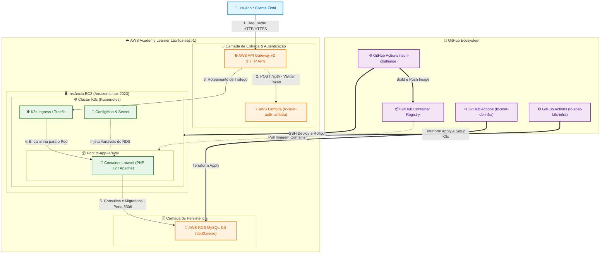

# 🍕 Tech Challenge - Aplicação Principal (Laravel API)

A aplicação principal do ecossistema **Tech Challenge**, responsável pelo gerenciamento de pedidos, produtos e clientes. O projeto roda sob uma arquitetura de containers orquestrada por **Kubernetes (K3s)** em uma instância AWS EC2, conectada a um banco **AWS RDS MySQL** e integrada a uma função **AWS Lambda** para autenticação.

---
## 📐 Arquitetura Geral da Solução



---

## 📚 Documentação de Arquitetura

Para acessar as RFCs, ADRs e o Diagrama ER do Banco de Dados[cite: 1]:
👉 [Acessar Pasta /docs/ARCHITECTURE.md](./docs/ARCHITECTURE.md)

## 🛠️ Tecnologias Utilizadas

* **Framework Backend:** PHP 8.2 / Laravel 10
* **Containerização:** Docker & GitHub Container Registry (`ghcr.io`)
* **Orquestrador:** K3s (Kubernetes leve) em AWS EC2 (`t2.micro` / Amazon Linux 2023)
* **Persistência de Dados:** AWS RDS MySQL 8.0 (`db.t3.micro`)
* **CI/CD:** GitHub Actions (`appleboy/ssh-action`)

---

## 🔑 Configuração de Secrets (GitHub Actions)

Para viabilizar a pipeline de CI/CD deste repositório, cadastre as seguintes Secrets em **Settings > Secrets and variables > Actions**:

| Secret | Descrição |
| :--- | :--- |
| `EC2_PUBLIC_IP` | Endereço IP público atual da instância EC2 (K3s Node) |
| `EC2_SSH_KEY` | Conteúdo completo da chave privada SSH (`vockey.pem`) |
| `GITHUB_TOKEN` | Token padrão de autenticação do GitHub (usado para publicar e puxar imagens do GHCR) |

---

## 🔄 Fluxo da Pipeline CI/CD

1. **Build & Push:** Compila a imagem Docker do Laravel e publica no `ghcr.io/william-moura/tech-challenge:master`.
2. **Auto-healing & Bootstrap do K3s:** Conecta via SSH na EC2. Caso o K3s ou os manifestos base ainda não estejam presentes na instância, executa a instalação do K3s e o apply dos manifestos base do repositório `tc-soat-k8s-infra`.
3. **Rollout da Aplicação:** Reinicia o deployment `tc-app-laravel` com a imagem atualizada e aguarda o status do Pod ficar `Running`.
4. **Execução Automática de Migrations:** Executa o comando `php artisan migrate --force` diretamente dentro do container ativo no K3s.

---

## 🧪 Execução Local com Docker Compose

Caso deseje testar a aplicação localmente sem dependência da nuvem:

```bash
# 1. Iniciar os containers da aplicação e do banco de dados
docker-compose up -d --build

# 2. Executar as migrations
docker-compose exec app php artisan migrate

# 3. Limpar caches do Laravel
docker-compose exec app php artisan config:clear